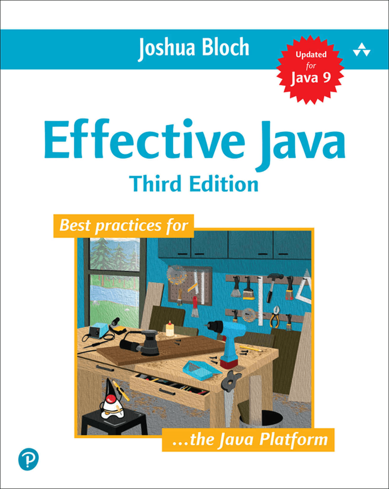

# EffectiveJava3-zh

Effective Java 第三版 中文翻译

在线阅读：[http://gdut_yy.gitee.io/doc-ej3/](http://gdut_yy.gitee.io/doc-ej3/)

<!--  -->

## 前言

## Index

- [第 2 章 创建和销毁对象](docs/ch2.md)
- [第 3 章 对象的通用方法](docs/ch3.md)
- [第 4 章 类和接口](docs/ch4.md)
- [第 5 章 泛型](docs/ch5.md)
- [第 6 章 枚举和注解](docs/ch6.md)
- [第 7 章 λ 表达式和流](docs/ch7.md)
- [第 8 章 方法](docs/ch8.md)
- [第 9 章 通用程序设计](docs/ch9.md)
- [第 10 章 异常](docs/ch10.md)
- [第 11 章 并发](docs/ch11.md)
- [第 12 章 序列](docs/ch12.md)

## 本地开发 & 阅读

本项目基于 vuepress 进行开发，以提供比 github mardown 更佳的阅读体验

依赖于 `node.js`、`yarn`、`vuepress` 等环境

```sh
# node
node -v
> v10.14.1
# yarn
yarn -v
> 1.13.0
# vuepress
yarn global add vuepress

# 本地开发
git clone https://github.com/gdut-yy/EffectiveJava3-zh.git
cd EffectiveJava3-zh
yarn docs:dev

# 本地阅读
http://localhost:8080/doc-ej3/
```

## License

[MIT](https://github.com/gdut-yy/EffectiveJava3-zh/blob/master/LICENSE)
